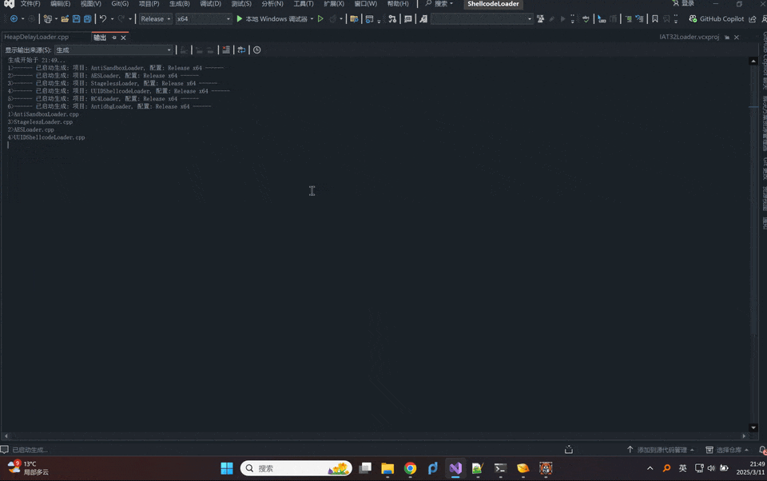
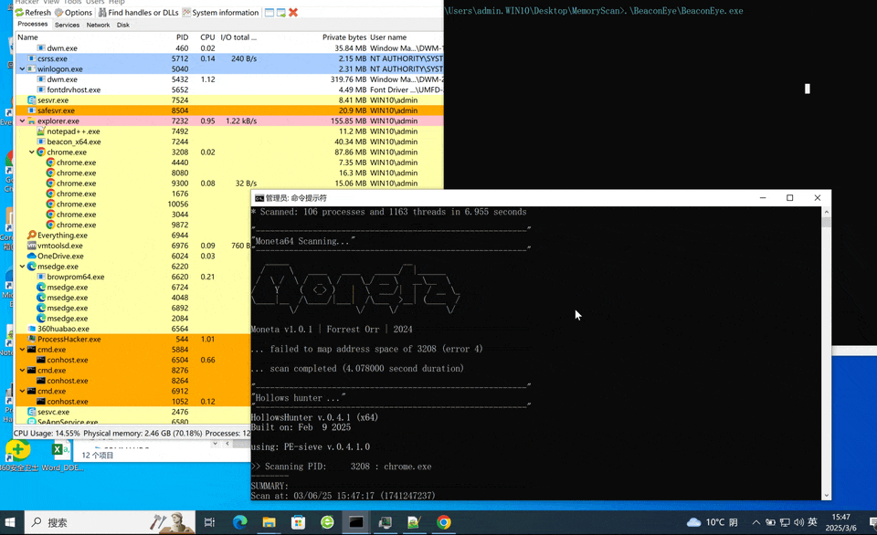

# AVEvasion

内存免杀Demo. Just a demo.

# 动态

补一个动态

# Bypass内存扫描

Demo仅演示Bypass常用内存扫描工具，进程注入等风险Bypass这里未作演示。

针对的内存扫描工具：
- [BeaconEye](https://github.com/CCob/BeaconEye)

- [Hunt-Sleeping-Beacons](https://github.com/thefLink/Hunt-Sleeping-Beacons)

- [pe-sieve](https://github.com/hasherezade/pe-sieve)

- [moneta](https://github.com/forrest-orr/moneta)

- [MalMemDetect](https://github.com/waldo-irc/MalMemDetect)

- [Yara](https://github.com/virustotal/yara)

  

## 原理
主要使用的思路和技术包括：CS自带内存规避相关机制，静态特征修改、变异的sleepmask、开源UDRL以及beacon Patch。

现有一些开源UDRL，Beacon休眠时可以过BeaconEye，但执行post-ex任务还是会被检测。
e.g

## Bypass Demo

